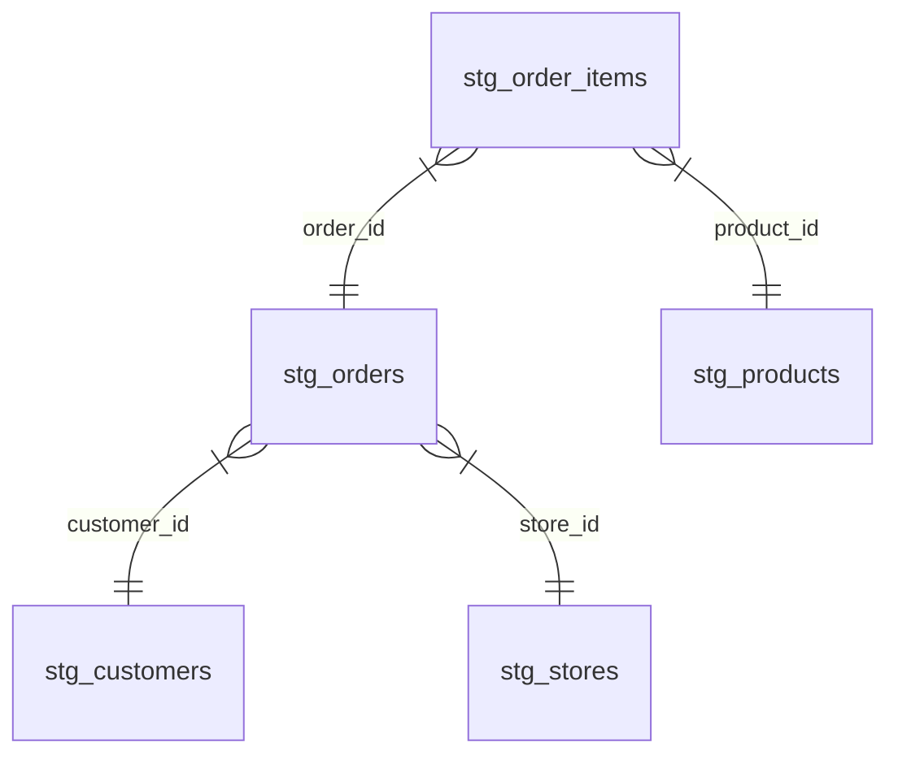

# Week 1: Staging & Dimensions

Welcome to Week 1 of the dbt Intern Track! This week you'll load the raw CSVs, write one clean `STAGE` view per source, and build the three dimension tables. Budget: **~2 hours**.

---

## 🍴 Step 1: Fork & Clone

1. **Fork** this repository to your own GitHub account.
2. **Clone** your fork to your local machine:
   ```bash
   git clone https://github.com/YOUR_USERNAME/dataops-labs-q3.git
   cd dataops-labs-q3
   cd dbt_learning
   ```

---

## 🚀 Step 2: Environment Setup (Python Virtual Environment)

Set up a Python virtual environment and install dbt locally.

**1. Create a virtual environment:**

```bash
python -m venv venv
```

**2. Activate the virtual environment:**

* **Windows (Command Prompt):** `venv\Scripts\activate.bat`
* **Windows (PowerShell):** `.\venv\Scripts\Activate.ps1`
* **Mac/Linux:** `source venv/bin/activate`

**3. Install dbt for PostgreSQL:**

```bash
pip install dbt-postgres==1.9.*
```

**4. Verify the installation:**

```bash
dbt --version
```

---

## 🗄️ Database Credentials

We use a local PostgreSQL database running in Docker. Configure your `profiles.yml` with:

* **Host:** `localhost`
* **Port:** `5432`
* **Database:** `ecommerce`
* **User:** `dataops`
* **Password:** `dataops_pass_2024`
* **Default Schema:** `DEV`

*(To start the database, run `docker compose up -d postgres` from the project root. then run 'dbt debug')*

---

## 🧊 Data Modeling 101: The Star Schema

Over the next few weeks you'll build a **Star Schema** data warehouse from the raw CSVs:

* **Dimension Tables (the "What"):** descriptive data about entities — Customers, Products, Stores.
* **Fact Tables (the "How much"):** transactional events — Orders and the items sold.

Here is how your staged models connect:



The rule to remember: **STAGE reads from RAW (the seeds); DEV reads only from STAGE.**

---

## 📖 Lesson Overview

This week we get the data in and clean it up.

* **Seeds:** load the 5 raw CSVs into the `RAW` schema with `dbt seed`.
* **The STAGE Layer:** one view per source that trims text, casts types, and standardizes casing.
* **The Dimensions:** three simple dimension tables (`dim_customers`, `dim_products`, `dim_stores`) built from the staged data.

---

## 📝 Assignment Tasks

### Task 1.1 — Load All Seeds (10 pts)

Run `dbt seed` to load all 5 CSV files into the `RAW` schema.

```bash
dbt seed --profiles-dir .
```

**Deliverable:** all 5 seeds loaded successfully into the `RAW` schema.

### Task 1.2 — Build 5 Staging Models (60 pts)

Create one staging view per seed in `models/stage/`. Basic cleaning: trim text, standardize casing, cast data types.

**💡 Pro-Tip: Example Staging Model**
Here is how `stg_orders.sql` might look. Note how we use `ref()` to pull from a seed, and `coalesce()` to default nulls:

```sql
with source as (
    select * from {{ ref('raw_orders') }}
),

cleaned as (
    select
        order_id::integer                               as order_id,
        trim(customer_id)::text                         as customer_id,
        order_date::date                                as order_date,
        lower(trim(status))::text                       as order_status,
        coalesce(shipping_fee, 0)::numeric(12,2)        as shipping_fee
    from source
)

select * from cleaned
```

**Deliverable:** all 5 SQL files under `models/stage/`:

* `stg_customers.sql` — trim + `initcap` names, lowercase email, cast `signup_date`
* `stg_products.sql` — trim `product_name`, cast prices to `numeric(12,2)`, cast `is_active` to boolean
* `stg_orders.sql` — lowercase + trim `status`, cast `order_date`, default `shipping_fee` nulls to 0
* `stg_order_items.sql` — cast `quantity` to integer, prices to `numeric(12,2)`, default `discount_pct` to 0
* `stg_stores.sql` — trim all text, `upper` the `region`, cast `opened_date`

Run them with:

```bash
dbt run --select stage --profiles-dir .
```

### Task 1.3 — Build the Three Dimensions (30 pts)

Create all three dimension tables in `models/dev/`, each from its staging model (reference the **STAGE** layer only, never a seed):

* `dim_customers.sql` — `customer_id`, `full_name` (`first_name || ' ' || last_name`), `email`, `phone`, `country`, `city`, `signup_date`
* `dim_products.sql` — the descriptive columns plus `unit_margin = list_price - cost_price`
* `dim_stores.sql` — `store_id`, `store_name`, `city`, `country`, `region`, `opened_date`

**Deliverable:** the three `dim_*.sql` files, materialized as tables.

Good luck! 🚀

---

## 🤖 Auto-Grade Your Work

Once you've completed all tasks, run the grading script:

```bash
python scripts/grade_assignment.py --week 1
```

The script verifies your files exist, contain the correct patterns, and build successfully. Fix any ❌ items and re-run until you're happy with your score.
